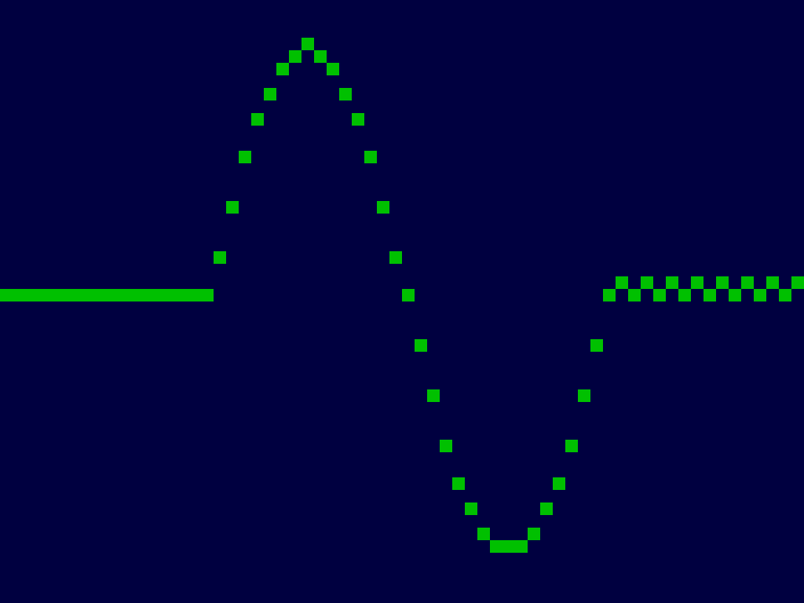

<!---

This file is used to generate your project datasheet. Please fill in the information below and delete any unused
sections.

The peripheral index is the number TinyQV will use to select your peripheral.  You will pick a free
slot when raising the pull request against the main TinyQV repository, and can fill this in then.  You
also need to set this value as the PERIPHERAL_NUM in your test script.

You can also include images in this folder and reference them in the markdown. Each image must be less than
512 kb in size, and the combined size of all images must be less than 1 MB.
-->

# VGA scope

Author: Ciro Cattuto

Peripheral index: nn

## What it does

The peripheral provides a 64x48 VGA scope to visualize time series of data. It generates a 1024x768 60Hz VGA signal (64 MHz pixel clock) suitable for a [TinyVGA PMOD](https://github.com/mole99/tiny-vga). The peripheral triggers the user interrupt once per frame refresh, after the bottom line of the screen has been painted.

## Register map

- Writing to `PUSHVAL` pushes a new value (6 bits, 0 to 47) to the VGA scope. The new value is shown on the rightmost column of the display, existing data scrolls left by one place, the leftmost sample drops off.
- Writing to `BGCOL` sets the background color (low 6 bits, 2 bits per color channel, BBGGRR order). The default color is dark blue (010000).
- Writing to `TXTCOL` sets the text color (low 6 bits, 2 bits per color channel, BBGGRR order). The default color is magenta 110011.
- `STATUS`: bit 0 signals that the peripheral is ready to process a new sample (this occurs during the vertical blank period of the VGA display). Bit 1 is the interrupt signal, bit 2 is vsync, bit 3 is hsync. Reading `VGA` clears the peripheral's interrupt signal.

| Address | Name    | Access | Description                                                             |
|---------|---------|--------|-------------------------------------------------------------------------|
| 0x00    | PUSHVAL | W      | Pushes a new value (0-47) to the VGA scope. The value is clamped at 47. |
| 0x01    | BGCOL   | W      | Background color: xxBBGGRR (default 010000, dark blue)                  |
| 0x02    | TXTCOL  | W      | Text color 1: xxBBGGRR (default 001100, green)                          |
| 0x3F    | STATUS  | R      | status: interrupt (bit 0), vsync (bit 1), hsync (bit 2). Clears interrupt on read. |

## How to test

Write a series of values between 0 and 47 to register `PUSHVAL`, check that they are visualized as 16x16 pixels and come into the screen from the right.

## External hardware

[TinyVGA PMOD](https://github.com/mole99/tiny-vga) for VGA output.

